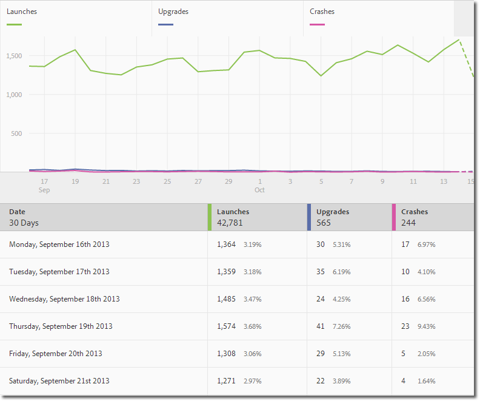
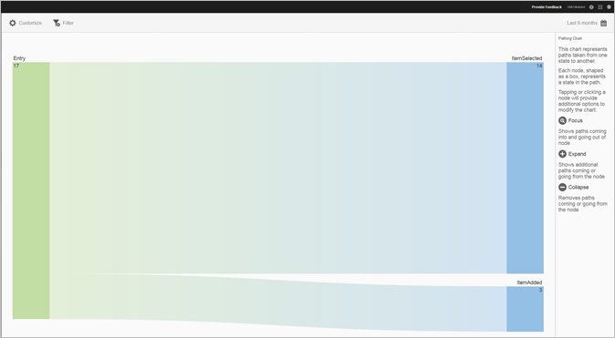

# Rapporttyper {#report-types}

När du anpassar rapporter kan den breda flexibiliteten skapa frågor om vilken typ av rapport som passar bäst för att få de data du behöver.

Innan du anpassar rapporter måste du förstå skillnaden mellan ett mått och en dimension.

* Mått

   Ett mätvärde används för att mäta dina data. Mätvärden är värden som kan räknas och läggas till och som används för att se hur ofta specifika åtgärder inträffar i appen. Vanliga mätvärden är installationer, starter, intäkter, livstidsvärde och inloggningar. Varje gång appen startas ökas värdet _launches_value med ett.

* Dimension

   En dimension används för att beskriva dina data. Dimensioner representeras av en sträng, eller ett tal som fungerar som en sträng (t.ex. ett postnummer), och används för att ordna och segmentera data. Exempel på vanliga dimensioner är OS-version, kampanjnamn, produktnamn och mobiloperatör. Varje dimension har ett antal specifika värden som är kopplade till den dimensionen. OS-versionsdimensionen har till exempel värden som _iOS 7_ och _Android 4.1.2_.

Här är de typer av rapporter som du kan generera i gränssnittet för mobila enheter:

## Övertidsrapport {#section_2741DA54C90C49AFB17C7B9BC7AD627D}

Övertidsrapporter visar hur mätvärden fungerar över ett tidsintervall så att ni snabbt kan identifiera toppar och trender. Analysen börjar ofta i en övertidsrapport och går in i trendrapporter och rankade rapporter när du går ned för att undersöka vilka faktorer som kan bidra till en mätspik eller trender.

Om du till exempel ser en ökning i lanseringarna kan du köra en trendrapport som visar starter för de fem främsta operativsystemen för att se vilka operativsystem som bidrar mest till toppen i starten:

Om du vill visa dimensionsvärden med andra mått i en övertidsrapport kan du använda instansmåttet och definiera ett dimensionsfilter.

## Trendrapport {#section_C9BE9A2EDBFF4D938B9AF14C8AA67883}

Med hjälp av trendrapporter kan du se hur de vanligaste måtten fungerar jämfört med ett mätresultat. Du kan använda den här rapporten för att avgöra vilka värden som bidrar mest till en ändring i ett mätresultat.

Om du vill visa en trendrapport för en dimension lägger du till ett klisterfilter (till exempel Operativsystem = iOS 6.0.1) i en övertidsrapport för att visa samma data. Som bonus kan du lägga till ytterligare fem mätvärden till den filtrerade övertidsrapporten.

## Filtrerad övertidsrapport {#section_F8FAF2A4496F449CA99EF1E052C71A2D}

Om du har ett visst dimensionsvärde som du vill visa kan du lägga till ett klisterfilter i en övertidsrapport. Följande rapport visar 30 dagars öppningar, uppgraderingar och krascher för en viss operativsystemversion.

## Rankad rapport {#section_C073D744A95843AF99EE74FB5B013735}

Rankade rapporter visar hur ofta de 50 viktigaste måtten bidrar till ett mätresultat. Den här rapporten är användbar om du vill visa det totala bidraget för ett datumintervall över ett stort antal värden.

## Sunburst Report {#section_17A9842039174DE094A6B1E9837E35BB}

Sunburst-rapporter innehåller till exempel basrapporten tillsammans med uppdelningar. I visualiseringen används höjd för att visa måtten och prestandaskillnaderna mellan mätvärdena. Varje koncentrisk cirkel representerar ett målgruppssegment i kategorin för den cirkeln. Du kan vidta åtgärder för en viss målgrupp, t.ex. använda ett klisterfilter, dölja ett mätvärde och visa mätvärden.

Du kan visa rapporten i en självstudiekurs som beskriver hur du interagerar med ett soldiagram.

Så här startar du självstudiekursen:

1. Klicka på **[!UICONTROL Usage]** i Hantera appinställningar.

1. Klicka på **[!UICONTROL Technology]** > **[!UICONTROL Technology Breakdown]**.
1. Klicka på **[!UICONTROL Customize]** i rapportens namnlist och klicka på informationsikonen.

### Målningsrapport {#section_AD400106BC684B50B27CCCD3F4497114}

En kundvägsrapport baseras på sökvägsanalys och visar ett målningsdiagram som representerar sökvägar som tagits från ett läge i appen till ett annat läge.

Varje nod är formad som en ruta och representerar ett läge i användarnas sökvägar via en app. I bilden ovan representerar till exempel den översta noden antalet användare som startade appen och valde ett foto från galleriet.

### Trattrapport {#section_AF3B0C899D844FC3AD1F91A2C452C92F}

Med trattrapporter kan ni identifiera var kunderna överger en marknadsföringskampanj eller avviker från en definierad konverteringsväg när ni interagerar med mobilappen. Du kan också använda Funnel-rapporten för att jämföra åtgärder för olika segment.

Med trattvisualiseringen kan ni se var kunderna hamnar utanför processen. Genom att få insyn i kundens beslut i varje steg får ni en förståelse för var kunderna avskräcks, vilken väg de tenderar att följa och när de lämnar er app.

