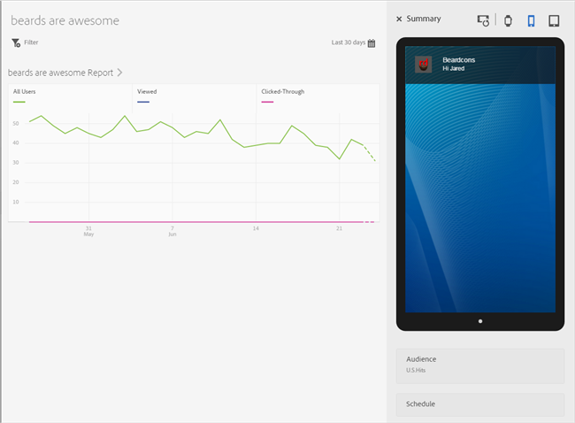
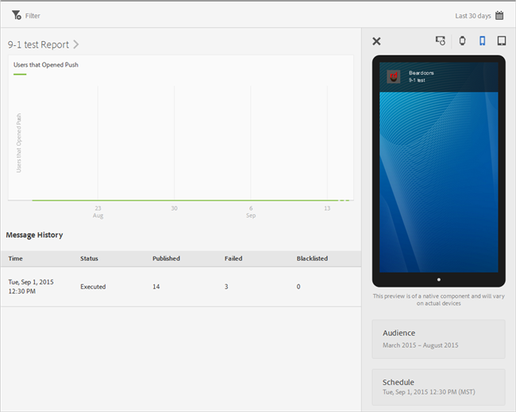

# Visa meddelanderapporter{#view-message-reports}

Du kan visa meddelanderapporter för meddelanden i programmet och push-meddelanden.

1. Klicka på  i **[!UICONTROL Report]** kolumnen för ett meddelande.
1. (**Valfritt**) Skapa ett klisterfilter för rapporten eller ändra tidsperioden genom att klicka på **[!UICONTROL Calendar]** ikonen.

   Mer information om hur du skapar ett klisterfilter finns i [Lägga till ett klisterfilter](/help/using/usage/reports-customize/t-sticky-filter.md).

>[!TIP]
>
>Beroende på vilken typ av meddelande du visar kan rapporten variera.

## Meddelanden i appen {#section_90B79BA58E8141F78538C187EB1BF8C7}

Om du visar rapporter för ett meddelande i appen ser rapporten ut ungefär som på följande bild:

### Meddelandestatistik i appen

Här är en lista över de mätvärden som är tillgängliga för meddelanden i appen:

* **[!UICONTROL Impression]**, när ett meddelande utlöses.

* **[!UICONTROL Click through]**, när en användare trycker på **[!UICONTROL Click Through]** knappen på ett varningsmeddelande eller helskärmsmeddelande och när en användare öppnar programmet från ett lokalt meddelande.

* **[!UICONTROL Cancel]** när en användare trycker på **[!UICONTROL Cancel]** knappen på en varning eller ett helskärmsmeddelande.

* **[!UICONTROL Engagement Rate]**, ett beräknat mått från Adobe Analytics och är resultatet av antalet klickningar delat med antalet visningar.

## Push-meddelanden {#section_BEAFD858CA194185B6F88903446058E9}

Om du visar rapporter för ett push-meddelande ser rapporten ut ungefär som på följande bild:

Diagrammet överst visar antalet användare som öppnade meddelandet.

### Mätvärden för push-meddelanden

Här är en lista över de mätvärden som är tillgängliga för push-meddelanden:

* **[!UICONTROL Time]**

   Den tidpunkt då meddelandet skickades till enheter från Mobile Services.

* **[!UICONTROL Status]**

   Meddelandets status och tillgängliga statusvärden är:

   * **[!UICONTROL Cancelled]**
   * **[!UICONTROL Scheduled]**
   * **[!UICONTROL Executing]**
   * **[!UICONTROL Executed]**

* **[!UICONTROL Published]**

   Antalet enhetstoken som skickats till Apple Push Notification Service/Firebase Cloud Messaging (APNS/FCM) för att skicka meddelandet till användarenheterna.

* **[!UICONTROL Failed]**

   Antalet enhetstoken som inte kunde skickas till APNS/FCM. Några möjliga orsaker till fel:

   * Ett ogiltigt pushID

   * Den push-plattform (APNS, FCM o.s.v.) som gavs för att skicka till finns inte för jobbprogrammet. Plattformen kan till exempel samla in push-tokens för iOS, men har ingen APNS-tjänst konfigurerad.

   * Meddelandet kan ha misslyckats på grund av att push-tjänsten inte konfigurerats korrekt eller att Mobile Services-systemet är avstängt.
   >[!IMPORTANT]
   >
   >Om du har ett ovanligt stort antal fel kontrollerar du konfigurationen för push-tjänster. Om push-tjänster verkar vara rätt konfigurerade kontaktar du Adobes kundtjänst.

* **[!UICONTROL Blocklisted]**

   Antalet enhetstoken som inte längre är giltiga för att skickas till APNS eller FCM. Det innebär vanligtvis att programmet har avinstallerats från enheten eller att användaren har ändrat sina inställningar för att ta emot meddelanden. Android och iOS skiljer sig åt när tokens räknas som blocklisted. Android-tokens visas omedelbart i blocklist-antalet. iOS-tokens visas först som publicerade, men baserat på feedback från APNS visas som blocklistade i efterföljande meddelanden.
