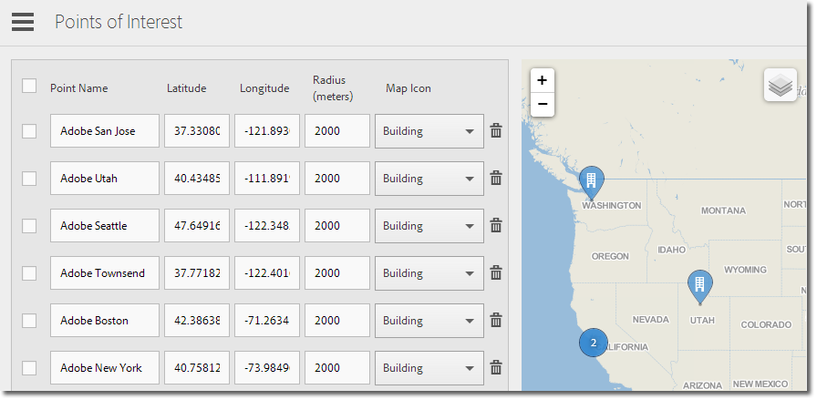

# Hantera intressepunkter {#manage-points-of-interest}

Du kan skapa och hantera POI:er, som gör att du kan definiera geografiska platser som du kan använda för korrelationssyften, rikta dig mot meddelanden i appen och så vidare. När en träff skickas i en POI kopplas POI till träffen.

Kontrollera följande krav innan du kan använda Plats:

* Ni måste ha Analytics - Mobile Apps eller Analytics Premium.
* Du måste aktivera **[!UICONTROL Location Reports]** för programmet.
* Om du använder en version av iOS SDK eller Android SDK som är äldre än version 4.2 måste du hämta en ny konfigurationsfil och ge den till programutvecklarna när du har lagt till en ny **[!UICONTROL Points of Interest]**.

   Om du använder iOS SDK eller Android SDK version 4.2 eller senare behöver du inte skicka in någon appuppdatering till butiken för att uppdatera din **[!UICONTROL Points of Interest]**. När du klickar på **[!UICONTROL Save]** på sidan Hantera intressepunkter paketeras ändringarna i listan **[!UICONTROL Points of Interest]** och konfigurationsfilen för den aktiva appen uppdateras. När du sparar uppdateras även listan med punkter i appen på användarenheterna, så länge appen använder den uppdaterade SDK:n och konfigurationen med en fjärr-POI-URL.

För att en träff ska tilldelas till en **[!UICONTROL Points of Interest]** på användarens enhet måste platsen vara aktiverad för appen.

Gör så här om du vill använda Plats:

1. Klicka på appens namn för att gå till sidan Hantera appinställningar.
1. Klicka på **[!UICONTROL Location]** > **[!UICONTROL Manage Points of Interest]**.

   

1. Skriv informationen i följande fält:

   * **[!UICONTROL Point Name]**

      Skriv namnet **[!UICONTROL Point of Location]**.

      Det kan vara namnet på en stad, ett land eller en region. Du kan också skapa en **[!UICONTROL Point of Location]** runt vissa platser, till exempel sportarenor eller företag.

   * **[!UICONTROL Latitude ]**

      Skriv latituden för **[!UICONTROL Point of Location]**. Den här informationen finns från andra källor, bland annat Internet.

   * **[!UICONTROL Longitude]**

      Skriv longituden för **[!UICONTROL Point of Location]**. Den här informationen finns från andra källor, bland annat Internet.

   * **[!UICONTROL Radius (Meters)]**

      Skriv radien (i meter) runt den **[!UICONTROL Point of Location]** som du vill ta med. Om du till exempel skapar en POI för Denver, Colorado, kan du ange en radie som är tillräckligt stor för att inkludera staden Denver och de omgivande områdena, men exkludera Colorado-strängar.

   * **[!UICONTROL Map Icon]**

      Välj en ikon som ska visas i [översikten](/help/using/location/c-location-overview.md) och [kartan](/help/using/location/c-map-points.md)-rapporterna.

1. Lägg till ytterligare POI efter behov.

   Vi rekommenderar att du inte lägger till fler än 5 000 POI. Om du lägger till fler än 5 000 kan du spara punkterna, men du får ett varningsmeddelande som informerar dig om att bästa praxis innebär att färre än 5 000 poäng används.

1. Klicka på **[!UICONTROL Save]**.

Om du vill ta bort en eller flera POI:er markerar du de tillämpliga kryssrutorna och klickar på **[!UICONTROL Remove Selected]**.

Klicka på **[!UICONTROL Import]** eller **[!UICONTROL Export]** om du vill arbeta med data genom att använda en `.csv`-fil i stället för att använda användargränssnittet för Adobe Mobile.
